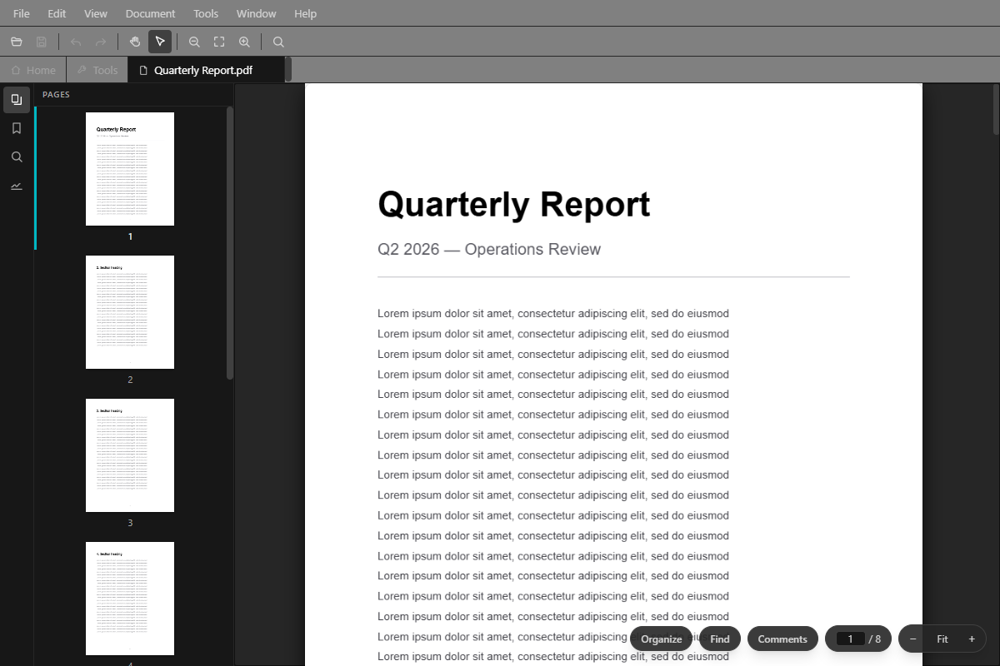
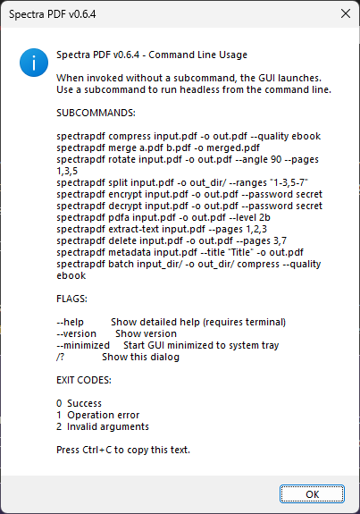
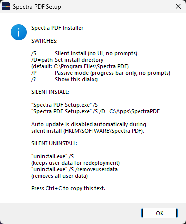

# Open PDF Studio

Modern, open-source PDF manipulation studio for Windows. Tauri v2 + React, with an embedded Python engine and vendored upstream Ghostscript (AGPL-3.0). No ads, no telemetry, no upsells. WebView2 prerequisite (ships with Windows 10/11).



## Features

| Feature | Engine | Status |
|---------|--------|--------|
| Merge PDFs | pikepdf | **Working** |
| Split by page range | pikepdf | **Working** |
| Rotate pages | pikepdf | **Working** |
| Delete pages | pikepdf | **Working** |
| Compress (presets + custom DPI) | Ghostscript | **Working** |
| Grayscale conversion | Ghostscript | **Working** |
| Optimize (linearize, strip, compress) | pikepdf | **Working** |
| PDF/A conversion | Ghostscript | **Working** |
| PDF version control | pikepdf | **Working** |
| Encrypt / decrypt | pikepdf | **Working** |
| Extract text | pdfminer.six | **Working** |
| Metadata editing + strip | pikepdf | **Working** |
| Thumbnail preview | pdf.js | **Working** |
| Page inspector | pdf.js | **Working** |
| Merge workspace | @dnd-kit | **Working** |
| NSIS installer | Tauri bundler | **Working** |
| Silent install / uninstall | NSIS `/S` | **Working** |
| File associations | .pdf handler | **Working** |
| Explorer context menu | Open / Merge with | **Working** |
| System tray | Minimize to tray, start minimized | **Working** |
| Start with Windows | HKCU Run key + --minimized | **Working** |
| Auto-update | tauri-plugin-updater | **Working** |
| Light/dark mode | CSS + Window.setTheme() | **Working** |
| GS engine detection | ARP registry + version query | **Working** |
| CLI / headless mode | clap + JSON-RPC | **Working** |
| Batch processing | CLI directory iteration | **Working** |
| WCAG 2.1 AA | All text ≥4.5:1, UI ≥3:1 | **Passing** |

## Command Line

Use `openpdfstudio.exe /?` to see all subcommands and flags:



When invoked with a subcommand, Open PDF Studio runs headless — no window, same engine.

```bash
# Compress
openpdfstudio compress input.pdf -o compressed.pdf --quality ebook

# Merge
openpdfstudio merge a.pdf b.pdf c.pdf -o merged.pdf

# Rotate
openpdfstudio rotate input.pdf -o rotated.pdf --angle 90 --pages 1,3,5

# Split
openpdfstudio split input.pdf -o output_dir/ --ranges "1-3,5-7"

# Encrypt / Decrypt
openpdfstudio encrypt input.pdf -o encrypted.pdf --password secret
openpdfstudio decrypt encrypted.pdf -o decrypted.pdf --password secret

# PDF/A
openpdfstudio pdfa input.pdf -o archive.pdf --level 2b

# Extract text
openpdfstudio extract-text input.pdf --pages 1,2,3

# Delete pages
openpdfstudio delete input.pdf -o trimmed.pdf --pages 3,7

# Metadata (read)
openpdfstudio metadata input.pdf

# Metadata (write)
openpdfstudio metadata input.pdf -o updated.pdf --title "New Title" --author "Name"

# Metadata (strip all)
openpdfstudio metadata input.pdf --strip -o stripped.pdf

# Grayscale
openpdfstudio grayscale input.pdf -o grayscale.pdf

# Optimize (linearize + strip metadata + compress streams)
openpdfstudio optimize input.pdf -o optimized.pdf --linearize --strip-metadata --compress-streams

# PDF version
openpdfstudio pdf-version input.pdf -o out.pdf --version 1.7

# Compress with custom DPI
openpdfstudio compress input.pdf -o compressed.pdf --dpi 200

# Batch — process every PDF in a directory
openpdfstudio batch C:\pdfs\ -o C:\out\ compress --quality ebook
openpdfstudio batch C:\pdfs\ -o C:\out\ rotate --angle 90
openpdfstudio batch C:\pdfs\ -o C:\out\ pdfa --level 2b
openpdfstudio batch C:\pdfs\ -o C:\out\ grayscale
openpdfstudio batch C:\pdfs\ -o C:\out\ optimize --strip-metadata
```

Results are JSON on stdout. Progress and errors go to stderr. Exit codes: 0 = success, 1 = operation error, 2 = bad args.

## Enterprise Deployment

Use `Setup.exe /?` to see all installer switches:



```bash
# Silent install (per-machine, auto-update disabled)
"Open PDF Studio_1.0.0_x64-setup.exe" /S

# Silent uninstall (keeps user data for redeployment)
"C:\Program Files\Open PDF Studio\uninstall.exe" /S

# Silent uninstall (removes all user data)
"C:\Program Files\Open PDF Studio\uninstall.exe" /S /removeuserdata
```

## Requirements

**End users**: WebView2 (included with Windows 10/11 via Edge). The interactive installer downloads the bootstrapper if missing.

> **Note on unsigned releases:** Open PDF Studio is distributed **unsigned** (no Authenticode code-signing certificate). On first run, Windows SmartScreen may show a blue *"Windows protected your PC — Unknown publisher"* prompt. This is expected for unsigned open-source software, not a sign of tampering. To proceed, click **More info → Run anyway**. Builds are published on the [releases page](https://github.com/jasonulbright/spectrapdf/releases).

**Developers**:

| Requirement | Version |
|-------------|---------|
| Node.js | 22 LTS (or 20.19+) |
| Rust | Stable toolchain |
| Ghostscript | None — vendored automatically by `bundle-ghostscript.ps1` |

Python 3.14 is embedded automatically — no system install needed.

## Quick Start (Development)

```bash
# Install Node.js dependencies
npm install

# Set up embedded Python (first time only)
powershell -ExecutionPolicy Bypass -File scripts\setup-python-embed.ps1

# Start development (Tauri dev server — launches Vite + Rust backend)
npm run dev
```

## Build

```bash
# Full build — bundles Python, GS, builds Rust backend, produces NSIS installer
npm run package
```

This runs `scripts/setup-python-embed.ps1` (downloads embedded Python 3.14 + pip-installs pikepdf/pdfminer), `scripts/bundle-ghostscript.ps1` (downloads the official upstream Ghostscript release, verifies its checksum, and vendors it into `resources/`), then `cargo tauri build` (compiles Rust, bundles WebView2 frontend, produces the NSIS installer).

Output: `src-tauri/target/release/bundle/nsis/Open PDF Studio Setup X.Y.Z.exe`

**Individual steps** (if needed):

| Command | What it does |
|---------|-------------|
| `npm run prepackage` | Downloads embedded Python + bundles GS (no compile) |
| `npm run build:renderer` | Vite production build of the React frontend |
| `npm run build` | `cargo tauri build` — Rust compile + NSIS installer (assumes prepackage already ran) |
| `npm run package` | All of the above in sequence |

## Architecture

```
+-------------------+      invoke()      +------------------+      JSON-RPC       +-------------------+
|   React UI        | <----------------> |   Rust Backend   | <--(stdin/stdout)--> |   Python Engine   |
|   (WebView2)      |                    |   (Tauri v2)     |                      |   (pikepdf + GS)  |
+-------------------+                    +------------------+                      +-------------------+
        |                                        |                                         |
        v                                        v                                         v
  WebView2 (Edge)                          Tauri commands                           Embedded Python 3.14
  - Welcome screen                         - File dialogs                           - 10 operation handlers
  - Thumbnail grid                         - File operations                        - pikepdf (structural)
  - Page inspector                         - Sidecar management                     - pdfminer.six (text)
  - Merge workspace                        - System tray                            - Ghostscript (upstream)
  - Collapsible sidebar                    - Single instance                          (compress, PDF/A)
  - Settings modal                         - Auto-updater
  - Undo/save/dirty tracking               - Registry policy check
```

**Frontend**: Tauri v2 (WebView2), React 19, TailwindCSS, pdf.js, @dnd-kit
**Backend**: Rust (Tauri commands) + Python 3.14 (embedded), pikepdf, pdfminer.six, Ghostscript (upstream, AGPL-3.0)
**IPC**: Tauri `invoke()` (JS→Rust), JSON-RPC 2.0 over stdin/stdout (Rust→Python)

## Project Structure

```
openpdfstudio/
├── src-tauri/                 # Tauri v2 Rust backend
│   ├── src/
│   │   ├── lib.rs             # App setup, tray, single-instance, events
│   │   ├── cli.rs             # CLI arg parsing, headless engine, batch mode
│   │   ├── commands.rs        # 16 IPC command handlers
│   │   └── engine.rs          # Python sidecar lifecycle
│   ├── tauri.conf.json        # Tauri config, NSIS, resources, plugins
│   ├── Cargo.toml             # Rust dependencies
│   └── nsis-hooks.nsh         # Context menu, registry, enterprise policy
├── src/
│   ├── renderer/              # React frontend (rendered by WebView2)
│   │   ├── App.tsx            # Root — views, state, file ops
│   │   ├── state/             # AppState context + reducer
│   │   ├── hooks/             # useEngine, useActiveFile
│   │   ├── lib/               # tauri-bridge, pdfRenderer
│   │   ├── components/        # Sidebar, ThumbnailGrid, PageInspector, etc.
│   │   └── panels/            # One panel per operation
│   ├── engine/                # Python PDF engine
│   │   ├── __main__.py        # JSON-RPC server, handler registration
│   │   ├── __startup__.py     # Embedded Python launcher
│   │   ├── ipc.py             # JSON-RPC protocol
│   │   └── *.py               # One file per operation
│   └── shared/
│       └── types.ts           # IPC type definitions
├── resources/
│   ├── python/                # Embedded Python 3.14 (gitignored, built by script)
│   └── ghostscript/           # Vendored upstream GS (gitignored, built by script)
├── scripts/
│   ├── setup-python-embed.ps1 # Downloads + configures embedded Python
│   └── bundle-ghostscript.ps1 # Downloads + vendors upstream GS
├── package.json
├── tsconfig.json
└── vite.config.ts
```

## License

MIT (application code). Bundled Ghostscript is unmodified upstream, licensed AGPL-3.0 — see [THIRD-PARTY-LICENSES.md](THIRD-PARTY-LICENSES.md).
