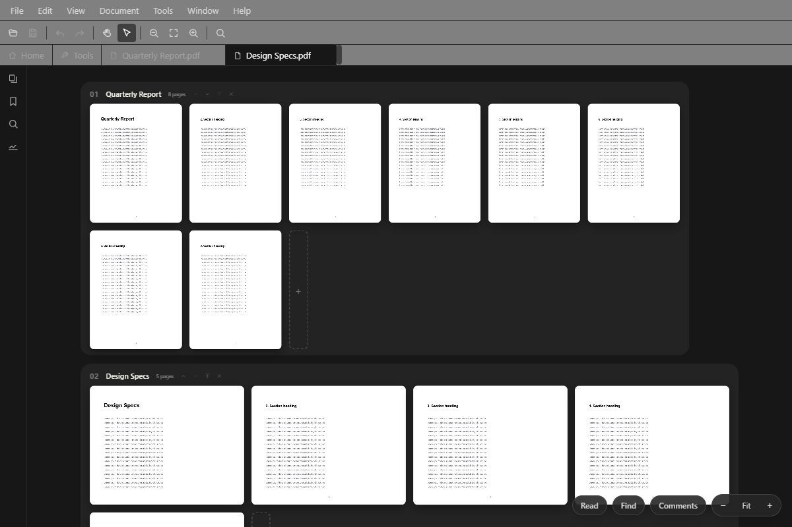
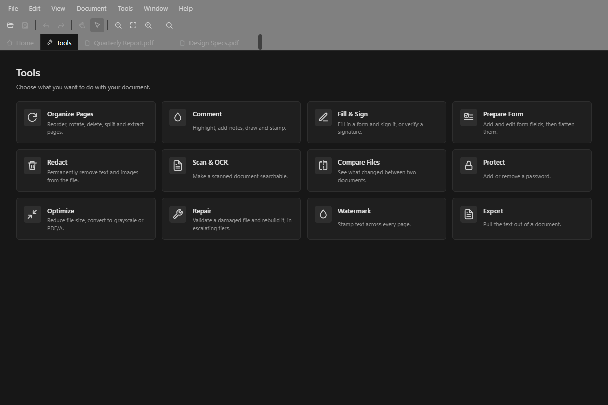

# Open PDF Studio

A modern, open-source PDF workbench for Windows. Tauri v2 + React, with an embedded Python engine and vendored upstream Ghostscript (AGPL-3.0). No ads, no telemetry, no upsells. WebView2 prerequisite (ships with Windows 10/11).


## What it is

A full-featured PDF workbench with a familiar user interface: a menu bar, main toolbar, and tabs over a continuous reading view, a navigation pane, and thirteen task-oriented tools — with a keymap verified against the industry-standard editor's published shortcut table, so your muscle memory just works. Every whole-file operation also ships as a CLI subcommand with identical results.

### Reading & navigating
- **Reading view** — continuous, virtualized scroll; smooth with 1,000-page documents. Real text selection and copy, zoom presets (`Ctrl+0/1/2`), go-to-page (`Ctrl+Shift+N`), Rotate View (`Ctrl+Shift+Plus/Minus` — the page turns, the file doesn't), Hand/Select with Space as a temporary hand
- **Organize view** — every open file as a strip of live page thumbnails; drag pages within and across documents, multi-select, whole-document merge, drop files to import their pages at that spot. All of it staged in memory, committed atomically, undoable
- **Navigation pane** (`F4`) — Pages (thumbnails with drag-reorder), Bookmarks (with editing), Search, Signatures
- **Find & Search** — floating find (`Ctrl+F`, `F3`/`Ctrl+G` stepping) and a workspace-wide Search panel (`Ctrl+Shift+F`); scanned pages become searchable (and selectable) via OCR
- **Batch OCR** (Tools ▸ Batch OCR Folder…) — point it at a folder and get a mirrored copy of the whole tree with every scanned PDF made searchable; already-searchable files copy through unchanged, problem files are reported, and the originals are never touched. Fully offline, like all OCR here



### The thirteen tools
Organize Pages · Comment (highlights, text boxes, ink, stamps — notes and recoloring on each, plus a comments sidebar; existing PDF annotations import as editable) · Edit (select an image, a paragraph, or a line of text on the page — replace, extract or delete images; rewrite text in place in the document's own font with live validation, and edit whole paragraphs with true rewrap inside the box, alignment and styles preserved) · Fill & Sign (AcroForm fill on the page, digital signatures: verify, sign with PFX/PEM, visible stamps, sign-into-field) · Prepare Form (draw new fields on the page) · Redact (true content removal) · Scan & OCR · Compare (text + visual diff) · Protect (AES-256 encrypt/decrypt) · Optimize (compress, grayscale, linearize, PDF/A, PDF version) · Repair (three tiers up to per-page salvage) · Watermark · Export (text extraction)



### Documents & files
- **Print** (`Ctrl+P`) — printer picker, page range, copies, fit/actual, through the bundled Ghostscript to any Windows printer
- **Document Properties** (`Ctrl+D`), categorized **Preferences** (`Ctrl+K`)
- Insert pages from a file (`Ctrl+Shift+I`) or blank (`Ctrl+Shift+T`), delete (`Ctrl+Shift+D`), rotate (`Ctrl+Shift+R`), split, extract
- `.pdfx` support — [Alexandros Gounis's open format](https://github.com/AlexandrosGounis/pdfx): several documents saved as one ordinary, fully-compatible PDF that reopens as separate strips
- Multi-level undo/redo across staged page edits and applied operations; one file is one document no matter how its path is spelled

### Desktop citizenship
NSIS installer with silent modes and enterprise policy, file associations, Explorer context menu, system tray, start-with-Windows, auto-update, light/dark/system themes with Windows accent + Mica, WCAG 2.1 AA, full keyboard navigation (single-key tool accelerators available, off by default).

## Command Line

When invoked with a subcommand, Open PDF Studio runs headless — no window, same engine. `openpdfstudio.exe /?` shows the full list.

```bash
# Compress
openpdfstudio compress input.pdf -o compressed.pdf --quality ebook

# Merge / split / rotate / delete
openpdfstudio merge a.pdf b.pdf c.pdf -o merged.pdf
openpdfstudio split input.pdf -o output_dir/ --ranges "1-3,5-7"
openpdfstudio rotate input.pdf -o rotated.pdf --angle 90 --pages 1,3,5
openpdfstudio delete input.pdf -o trimmed.pdf --pages 3,7

# Print — to any installed Windows printer, via the bundled Ghostscript
openpdfstudio printers                       # list printers (JSON, with the default)
openpdfstudio print input.pdf --printer "Brother HL-L2400D" --pages 1-3 --copies 2 --fit fit

# Encrypt / decrypt
openpdfstudio encrypt input.pdf -o encrypted.pdf --password secret
openpdfstudio decrypt encrypted.pdf -o decrypted.pdf --password secret

# PDF/A, optimize, grayscale, version
openpdfstudio pdfa input.pdf -o archive.pdf --level 2b
openpdfstudio optimize input.pdf -o optimized.pdf --linearize --strip-metadata --compress-streams
openpdfstudio grayscale input.pdf -o grayscale.pdf
openpdfstudio pdf-version input.pdf -o out.pdf --version 1.7

# Text, metadata
openpdfstudio extract-text input.pdf --pages 1,2,3
openpdfstudio metadata input.pdf --title "New Title" -o updated.pdf
openpdfstudio metadata input.pdf --strip -o stripped.pdf

# Forms — list fields (JSON), or fill (± flatten)
openpdfstudio forms input.pdf
openpdfstudio forms input.pdf -o filled.pdf --set name=Ada --set subscribe=true --flatten

# Bookmarks — read (JSON) or replace
openpdfstudio outline input.pdf
openpdfstudio outline input.pdf -o out.pdf --from-json bookmarks.json

# Signatures
openpdfstudio verify-signatures signed.pdf
openpdfstudio sign input.pdf -o signed.pdf --pfx signer.pfx --password pass
openpdfstudio generate-signer -o me.pfx --cn "My Name" --password pass

# Compare, redact, watermark, repair tiers
openpdfstudio compare a.pdf b.pdf
openpdfstudio redact input.pdf -o redacted.pdf --page 1 --rect 100,100,300,150
openpdfstudio watermark input.pdf -o marked.pdf --text "CONFIDENTIAL"
openpdfstudio repair broken.pdf -o repaired.pdf
openpdfstudio rebuild broken.pdf -o rebuilt.pdf
openpdfstudio recover broken.pdf -o recovered.pdf
openpdfstudio check input.pdf

# Batch — process every PDF in a directory
openpdfstudio batch C:\pdfs\ -o C:\out\ compress --quality ebook
```

Results are JSON on stdout. Progress and errors go to stderr. Exit codes: 0 = success, 1 = operation error, 2 = bad args.

## Enterprise Deployment

```bash
# Silent install (per-machine, auto-update disabled)
"Open PDF Studio_2.0.0_x64-setup.exe" /S

# Silent uninstall (keeps user data for redeployment)
"C:\Program Files\Open PDF Studio\uninstall.exe" /S

# Silent uninstall (removes all user data)
"C:\Program Files\Open PDF Studio\uninstall.exe" /S /removeuserdata
```

Auto-update can be disabled machine-wide via `HKLM\SOFTWARE\Open PDF Studio\DisableAutoUpdate = 1` (set automatically by the silent installer). Ghostscript and the Python runtime are bundled — nothing else to deploy. The installer's own `/?` dialog documents all switches:


## Requirements

**End users**: WebView2 (included with Windows 10/11 via Edge). The interactive installer downloads the bootstrapper if missing.

> **Note on unsigned releases:** Open PDF Studio is distributed **unsigned** (no Authenticode code-signing certificate). On first run, Windows SmartScreen may show a blue *"Windows protected your PC — Unknown publisher"* prompt. This is expected for unsigned open-source software, not a sign of tampering. To proceed, click **More info → Run anyway**. Builds are published on the [releases page](https://github.com/jasonulbright/Open-PDF-Studio/releases).

**Developers**:

| Requirement | Version |
|-------------|---------|
| Node.js | 22 LTS (or 20.19+) |
| Rust | Stable toolchain |
| Ghostscript | None — vendored automatically by `bundle-ghostscript.ps1` |

Python 3.14 is embedded automatically — no system install needed.

## Quick Start (Development)

```bash
# Install Node.js dependencies
npm install

# Set up embedded Python (first time only)
powershell -ExecutionPolicy Bypass -File scripts\setup-python-embed.ps1

# Start development (Tauri dev server — launches Vite + Rust backend)
npm run dev
```

## Build

```bash
# Full build — bundles Python, GS, builds Rust backend, produces NSIS installer
npm run package
```

This runs `scripts/setup-python-embed.ps1` (downloads embedded Python 3.14 + pip-installs the hash-pinned engine deps), `scripts/bundle-ghostscript.ps1` (downloads the official upstream Ghostscript release, verifies its checksum, and vendors it into `resources/`), then `cargo tauri build` (compiles Rust, bundles the WebView2 frontend, produces the NSIS installer).

Output: `src-tauri/target/release/bundle/nsis/Open PDF Studio_X.Y.Z_x64-setup.exe`

**Individual steps** (if needed):

| Command | What it does |
|---------|-------------|
| `npm run prepackage` | Downloads embedded Python + bundles GS (no compile) |
| `npm run build:renderer` | Vite production build of the React frontend |
| `npm run build` | `cargo tauri build` — Rust compile + NSIS installer (assumes prepackage already ran) |
| `npm run package` | All of the above in sequence |

## Architecture

```
+-------------------+      invoke()      +------------------+      JSON-RPC       +-------------------+
|   React UI        | <----------------> |   Rust Backend   | <--(stdin/stdout)--> |   Python Engine   |
|   (WebView2)      |                    |   (Tauri v2)     |                      |   (pikepdf + GS)  |
+-------------------+                    +------------------+                      +-------------------+
        |                                        |                                         |
        v                                        v                                         v
  WebView2 (Edge)                          Tauri commands                           Embedded Python 3.14
  - Menu bar / toolbar / tabs              - File dialogs + path canon              - 30+ operation handlers
  - Reading view (virtualized)             - Printer enumeration                    - pikepdf (structural)
  - Organize board (page strips)           - Sidecar management                     - pdfminer.six (text)
  - Navigation pane                        - System tray                            - pyHanko (signatures)
  - Twelve task panes                      - Single instance                        - Ghostscript (upstream:
  - Command registry + keymap              - Auto-updater                             compress, PDF/A, print)
  - pdf.js render + text layer             - Registry policy check
```

**Frontend**: Tauri v2 (WebView2), React 19, TailwindCSS, pdf.js, pdf-lib, tesseract.js
**Backend**: Rust (Tauri commands) + Python 3.14 (embedded), pikepdf, pdfminer.six, pyHanko, Ghostscript (upstream, AGPL-3.0)
**IPC**: Tauri `invoke()` (JS→Rust), JSON-RPC 2.0 over stdin/stdout (Rust→Python)

## Project Structure

```
openpdfstudio/
├── src-tauri/                 # Tauri v2 Rust backend
│   ├── src/
│   │   ├── lib.rs             # App setup, tray, single-instance, events
│   │   ├── cli.rs             # CLI arg parsing, headless engine, batch mode
│   │   ├── commands.rs        # IPC command handlers (dialogs, paths, printers…)
│   │   ├── printers.rs        # winspool printer enumeration
│   │   └── engine.rs          # Python sidecar lifecycle
│   ├── tauri.conf.json        # Tauri config, NSIS, resources, plugins
│   └── nsis-hooks.nsh         # Context menu, registry, enterprise policy
├── src/
│   ├── renderer/              # React frontend (rendered by WebView2)
│   │   ├── App.tsx            # Root — dialogs, funnels, state wiring
│   │   ├── commands/          # Command registry, menus, keymap, tools model
│   │   ├── state/             # AppState reducer, selectors, types
│   │   ├── components/        # Chrome (MenuBar/MainToolbar/TabStrip…),
│   │   │   ├── canvas/        #   the reading view + organize board
│   │   │   └── navpane/       #   the navigation pane panels
│   │   ├── panels/            # One task pane per operation
│   │   ├── search/, ocr/      # Find/Search engine, tesseract.js OCR
│   │   ├── hooks/, lib/       # Engine bridge, commit gate, pdf builders
│   │   └── testHarness.ts     # e2e hooks (compiled in only with VITE_E2E)
│   └── engine/                # Python PDF engine (one file per operation)
├── e2e-tests/                 # WDIO specs against the built binary
├── tests/                     # vitest (renderer) + pytest (engine)
├── resources/                 # Embedded Python + vendored GS (built by scripts)
└── scripts/                   # setup-python-embed.ps1, bundle-ghostscript.ps1
```

## License

MIT (application code). Bundled Ghostscript is unmodified upstream, licensed AGPL-3.0 — see [THIRD-PARTY-LICENSES.md](THIRD-PARTY-LICENSES.md).
